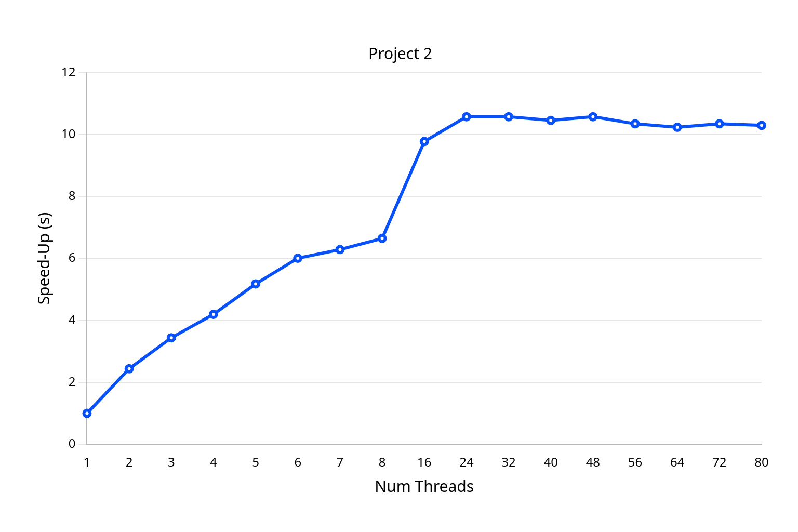

Original Output

|Thread Count|Wall Clock Time|User Time|System Time|Speedup|
|:--:|--:|--:|--:|:--:|
|1|19.36|14.01| 2.55|1.00|
|2| 7.93|14.63| 0.54| 2.44|
|3| 5.63|15.09| 0.73| 3.44|
|4| 4.61|16.08| 0.72| 4.20|
|5| 3.74|15.69| 0.91| 5.18|
|6| 3.22|15.68| 0.98| 6.01|
|7| 3.08|17.46| 0.99| 6.29|
|8| 2.91|18.02| 1.34| 6.65|
|16| 1.98|18.56| 2.98| 9.78|
|24| 1.83|18.79| 7.06|10.58|
|32| 1.83|18.76|14.74|10.58|
|40| 1.85|18.05|23.22|10.46|
|48| 1.83|17.48|34.28|10.58|
|56| 1.87|17.48|36.37|10.35|
|64| 1.89|17.16|41.77|10.24|
|72| 1.87|17.19|39.88|10.35|
|80| 1.88|17.53|33.48|10.30|

Graph of Speedup Times

Second Output

main program 0.00797487 s
results output 4.7e-07 s
main program 2.536468347 s
main program 2.537372657 s

The serial portion of my program was:

$$ s = \frac{0.00797534}{2.537372657} \approx 0.00314 $$

So the parallel portion is:

$$ p = 1 - s = 1 - 0.00314 = 0.99686 $$

Using Amdahl’s Law with 16 threads:

$$ \text{speedup} = \frac{1}{1 - p + \frac{p}{n}} = \frac{1}{1 - 0.99686 + \frac{0.99686}{16}} = \frac{1}{0.06544} \approx 15.28 $$

Using rise over run from 1 to 7 threads:

$$
\text{slope} = \frac{6.29 - 1.00}{7 - 1} = \frac{5.29}{6} \approx 0.882
$$

So the speedup increases by about 0.88x for each added thread in that range, indicating a nearly linear trend initially.

However, this linear trend **does not continue** as we increase thread count. For example, with 64 threads, we only get a speedup of about 10.24 — far below the linear prediction of ~56.

This flattening occurs due to:
- The serial portion of the program (Amdahl’s Law),
- Increased overhead from thread management and synchronization,
- Resource contention (e.g., memory, locks),
- And insufficient workload per thread at high counts.

